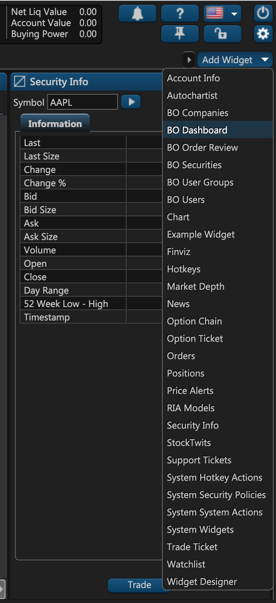
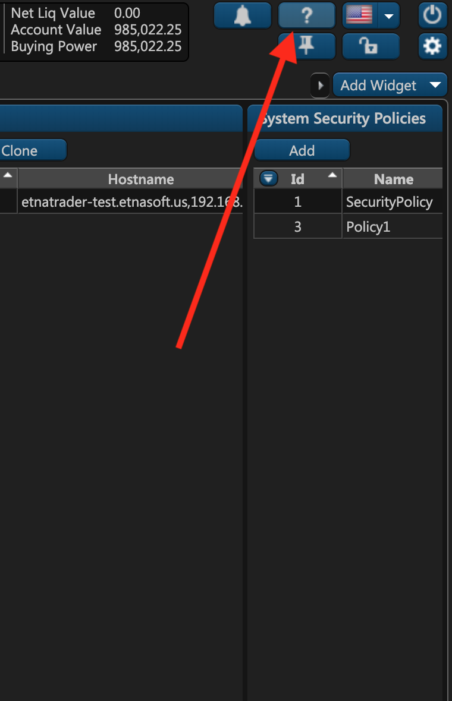

# 5. Layout

On the fifth tab of the company creation window you can configure the layout settings.


## Show Header

When this checkbox is deselected, the uppermost header will be hidden from the users of this company.


## Show Tabs

When this checkbox is deselected, the tab toolbar will be hidden from the users.


## Show Widget Frame

When this checkbox is deselected, the widget selection window will be hidden from the users of this company.



## Default Tab

This text field indicates the default tab that will be displayed to the users of this company when they initially log in.

## Allow Settings Override via URL

ETNA Trader can be embedded into a different website as an iframe. Clearly, some layout components will likely be hidden to preserve space. The list of components that can be hidden includes Header, Tabs, and the Widget Frame.

When you select the **Allow Settings Override via URL** checkbox, you authorize this company to override the first three checkboxes of the **Layout** tab in the URL:

```text
etnatrader.com/Home/Index?ShowHeader=%true%&ShowTabs=%false%&ShowWidgetFrame=%true%
```

## Show Footer & Footer HTML

When this option is deselected, the footer block will be hidden from the users of this company.


If this feature is enabled, you can provide your custom footer block in the HTML format. Embed your HTML into the **Footer HTML** text field below the **Show Footer** checkbox. When the users of this company log in to the web terminal, they will see your custom footer at the bottom of the page.

## Show Message Area & Message Area HTML

Similar to the previous option, the message area \(located underneath the header\) can be customized with your HTML code. If you want to customize the message area, simply select the **Show Message Area** checkbox and then insert the HTML code in the **Message HTML** text field.

## **Show Custom Support Page**

This option allows you to provide a custom support page that your users can access for troubleshooting. Enter the URL of your support page \(something like yourcompany.com/support\), and the question mark button in upper right-hand corner will be transformed into a drop-down menu where, in addition to your help, users will also be able to navigate to your support page.



## Pre-Population of Security

When you initially add a chart widget or any other widget that is related to a particular security, this widget is empty because no default value was specified. If you want to provide a default value for such widgets, you can use the **Pre-Population of Security** option. Simply select the checkbox, specify the security ID, and then this security will serve as the default value in all security-related widgets.

