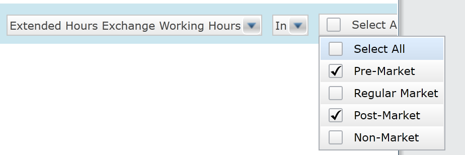
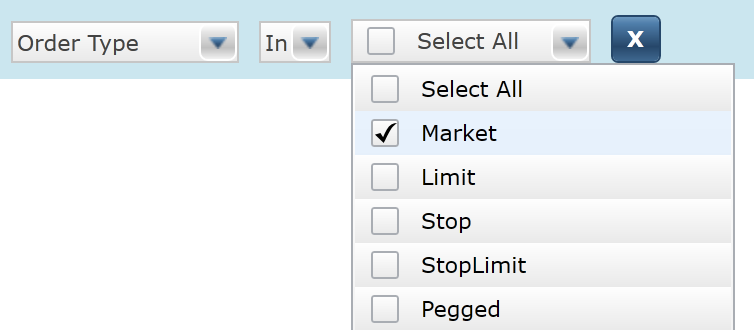
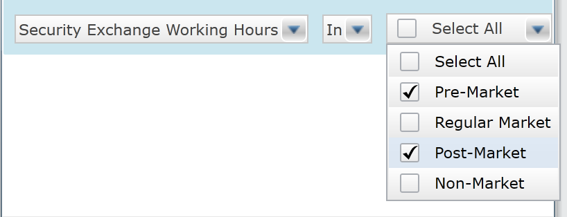
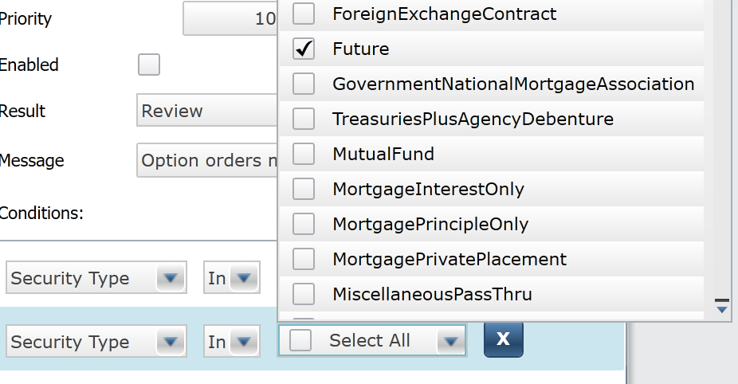

# Types of Conditions

### Conditions

In ETNA Trader, each risk rule can have multiple conditions, and an order must simultaneously satisfy all conditions of an active rule before it is detected by the system and then sent for review. There are a total of 29 different conditions that can be specified in each rule.

#### **1. Account**

Use this condition to apply the order review mechanism only to specific trading accounts. You can specify multiple accounts, and this rule will be applied to all of them. Alternatively, you can specify to which accounts this rule should not be applied by selecting the **NotIn** option.

#### **2. Average Daily Volume**

Use this condition to apply the order review mechanism only to to those trading accounts whose average daily volume exceeds or is less than the specified amount. Gt refers to "greater" while Lt refers to "less than".

#### 3. Clearing Firm

Use this condition to apply the order review mechanism only to those trading accounts who belong to a particular clearing firm that is indicated in the the text field. Alternatively, you can enforce this rule for all accounts except for the specified by selecting **NotIn** in the drop-down menu.

#### 4. Day Loss

Use this condition to apply the order review mechanism only to those trading accounts whose current day loss is greater than or equal to the specified amount.

#### 5. **Days to Expiration**

Use this condition to apply the order review mechanism to the options whose expiration date is exactly the specified number of days from now.

#### 6. Exchange Destination ???

#### 7. Exchange Working Hours

Use this condition to apply the order review mechanism to all orders placed during specific trading hours. For example, you can use this rule to review all orders placed during the pre- and post-market hours.

#### 8. Execution Instructions 

Use this condition to apply the order review mechanism to all orders that must either be executed entirely or not at all. 


Options **DoNotIncrease** and **DoNotReduce** are currently unavailable.


#### 9. Execution Venue

Use this condition to apply the order review mechanism to all orders that should be placed on the selected exchanges \(the list of options may vary depending on which exchanges are available to your company\).

#### 10. Extended Hours

Use this condition to apply the order review mechanism to all orders that are placed during extended market hours.

#### 11. Extended Hours Exchange Working Hours ???

Use this condition to apply the order review mechanism to all orders that are placed ???

#### 12. Is Halted Security

Use this condition to apply the order review mechanism to all orders in which the underlying security is suspended from trading by the relevant exchange.  

#### 13. Is contingent ??? 

#### 14. Legs Quantity

Use this condition to apply the order review mechanism to all multi-leg option orders. A multi-leg order is a type of order used to buy or sell options with more than one strike price, expiration date, or sensitivity to the underlying security's price. In the text field you should specify the number of legs of an order that should be flagged and sent for review.

#### 15. Margin Requirement Cash ??? 

#### 16. Opening/Closing Order

Use this condition to apply the order review mechanism to all orders that are either opening a new position or closing an existing position.

#### 17. Option Expiration Type

Use this condition to apply the order review mechanism to all option orders with a particular expiration type. Alternatively, you could apply the order review mechanism to all expiration types except for the selected ones by selecting the **NotIn** option.

#### 18. Order Duration 

Use this condition to apply the order review mechanism to all orders with a particular duration. There are three duration types to choose from:

1. **Day**. This rule will only be applied to orders that expire at the end of the current trading session. 
2. **GoodTillCancel**. This rule will only be applied to orders that are active until cancelled.
3. **GoodTillDate**. This rule will only be applied to orders that expire at a particular date.

#### 19. Order Fields

Use this condition to apply the order review mechanism to all orders where particular fields have been modified. This rule might be useful in preventing placement of orders with fields that are not supported on particular exchanges.

Some of these fields are not available in the web terminal and can only be used when invoking our external API.

#### 20. Order Side

Use this condition to apply the order review mechanism to all orders with a particular trade side. There are four options to choose from:

1. **Buy**. These are the types of orders that concern buying securities.
2. **Sell**. These are the types of orders that concern selling securities.
3. **SellShort**. These are the types of orders in which a trader is selling the broker's shares in an attempt to buy them back cheaper, and return those shares with interest back to the broker while pocketing the profit from the security price depreciation.
4. **BuyToCover**. These are the types of orders in which a trader is buying back the shares they had previously sold short \(to return the shares back to the broker\).

#### 21. Order Total 

Use this condition to apply the order review mechanism to all orders whose total price \(number of shares multiplied by the limit price\) exceeds or is less than the specified amount. For example, if you set the order total  to $100'000, whenever one of your users places an order with a higher total price, that order will be flagged and sent for review.

#### 22. Order Type

#### 23. Overall Quantity

#### 24. Price

#### 25. Quantity

#### 26. Security

#### 27. Security Exchange

#### 28. Security Exchange Working Hours ???

#### 29. Security Type

