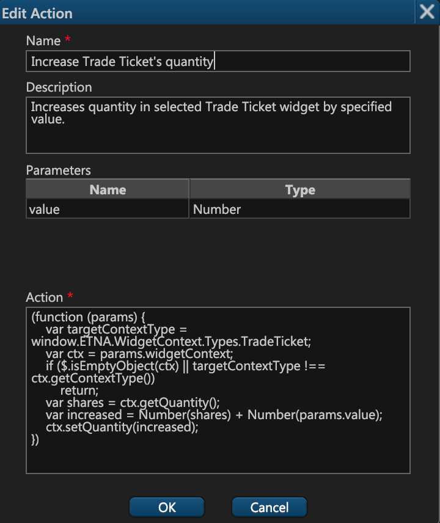
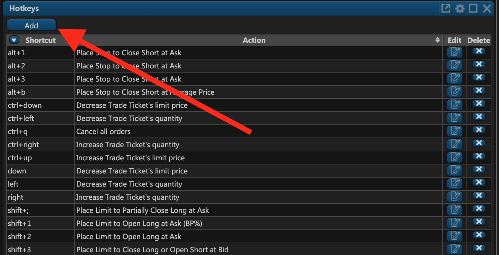
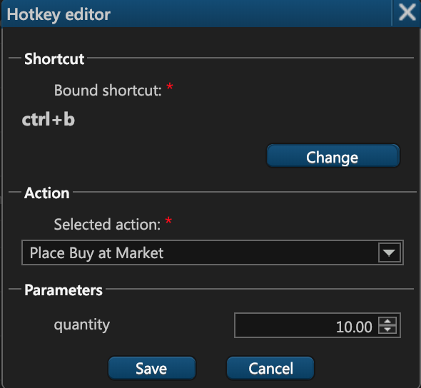

# System Hotkey Actions

### Introduction

ETNA Trader provides rich shortcut functionality to users who'd like to streamline their trading routine with hotkeys. If you need to buy a security or cancel all active orders with a single press of a key — ETNA Trader enables you to configure such shortcuts for various events. The range of actions that can be mapped to keyboard keys is determined by administrators through the **System Hotkey Actions** widget. Once these actions are configured, users may proceed to map them to the preferred keys via the **Hotkeys** widget.

### The System Hotkey Actions Widget

To add the System Hotkey Actions widget, click **Add Widget** and then click **System Hotkey Actions**. 


If you don't see the **System Hotkey Actions** widget, it's likely that you're logged in as a user, and not as an administrator \(this widget is only available to administrators\).


The widget will appear, listing all of the default events that can later be mapped to certain keys.

In the following sections we'll cover the default actions and also how you can create your own custom actions.

### Default Actions

Out of the box, ETNA Trader provides 14 actions that users can map to certain keys:

1. **Place Stop to Close Short at Average Price**. This action places a stop-loss order to close an existing short position at the average price of the position.
2. **Place Stop to Close Short at Ask**. This action places a stop-loss order to close an existing short position at the current ask price offset by the user-specified value.
3. **Place Stop to Close Short at Ask**. This action places a stop-loss order to close an existing long position at the bid price offset by the user-specified value.
4. **Place Stop to Close Long at Bid**. This action places a stop-loss order to close an existing long position at the average price of the position.
5. **Place Limit to Partially Close Long at Bid**. This action places a limit order to close a fraction of an existing long position at the bid price offset by the user-specified value.
6. **Place Limit to Partially Close Long at Ask**. This action places a limit order to close a fraction of an existing long position at the ask price offset by the user-specified value.
7. **Place Limit to Open Long at Ask \(BP%\)**. This action places a limit order to open a long position at the ask price, amounting to a specified fraction of the gross buying power.
8. **Place Limit to Open Long at Ask**. This action places a limit order to open a long position with the specified share quantity at the ask price.
9. **Place Buy at Market**. This action places a buy order at the market price. 
10. **Increase Trade Ticket's quantity**. This action increases the quantity of shares in the **Trade Ticket** widget by the specified amount.
11. **Increase Trade Ticket's limit price**. This action increases the purchasing price of shares in the **Trade Ticket** widget by the specified amount.
12. **Decrease Trade Ticket's quantity**. This action decreases the quantity of shares in the **Trade Ticket** widget by the specified amount.
13. **Decrease Trade Ticket's limit price**. This action decreases the purchasing price of shares in the **Trade Ticket** widget by the specified amount.
14. **Cancel all orders**. This action cancels all outstanding orders for the current ticker.

### Modifying the Existing Actions

In addition to creating your own custom actions, you may also modify the existing ones. To modify an action, click on the edit icon \(the third column\). To add a new action, click **Add Action**.

The action creation window will appear, prompting you to configure the following action properties:

1. **Name**. This is the name of the new action — the users will see it in the action list when creating hotkeys.
2. **Description**. This is the description of the new action. 
3. **Parameters**. These are the parameters that users will have to specify when creating a hotkey. For example, if a user is creating a hotkey for an action that increases the quantity of shares in the **Trade Ticket** widget, they'll have to specify the increase value here.
4. **Action**. This is the JavaScript code that will be executed when a user triggers a hotkey. To learn more about the syntax of these actions, read our [dedicated article](action-syntax.md).

Once you're finished configuring the action, click **OK**.

### Mapping Actions to Hotkeys

As an administrator, once you have configured all of the required actions, go ahead and map those actions to the default user's hotkeys. These hotkeys will automatically be available to each new user, as the default user's settings are always copied to new users. Actions can be mapped to hotkeys through the **Hotkeys** widget.

This widget lists all of the existing shortcuts, and it also allows you to modify or remove them. To create a new hotkey, click **Add**.

In the appeared pop-up window, indicate the following parameters:

* **Shortcut**. This is the key combination that will trigger the associated action.
* **Action**. Expand the drop-down menu and select one of the actions you've created on the **System Hotkey Actions** widget.
* **Parameters**. These are the parameters that are passed to the action's JavaScript methods. 

When done, click **Save**, and from now on the default user \(and all other subsequently created users\) will be able to use this hotkey to place buy orders at the market price.

