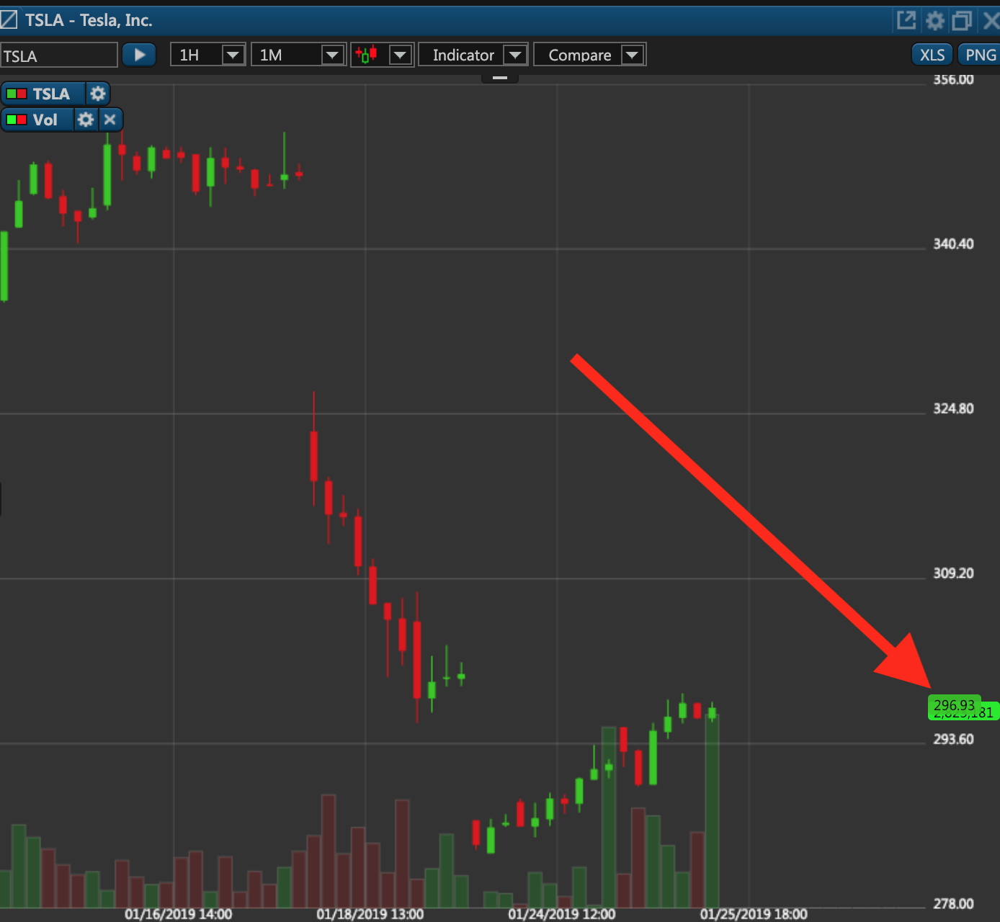
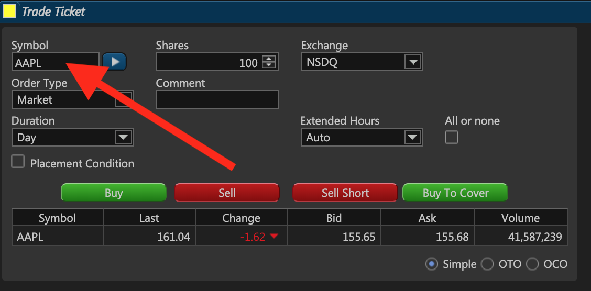
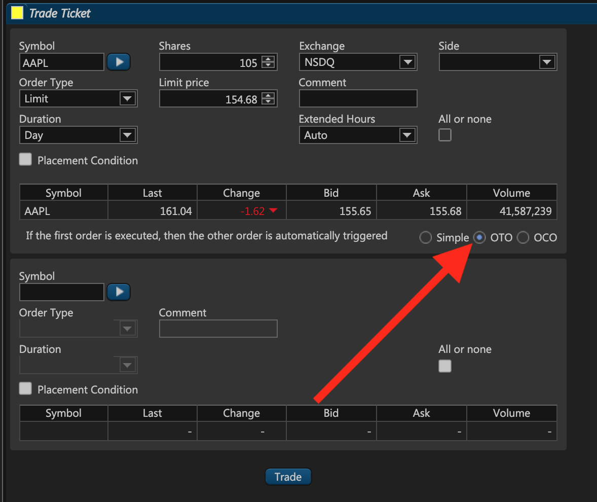

# Action Syntax

### Introduction

When a user triggers a hotkey, the [previously defined action](./) associated with this hotkey is executed. Such action represents JavaScript code that developers can implement to simplify trading routines. For example, you can create an action that doubles the number of shares in the **Trade Ticket** widget. But before that you should learn how to access the data in such widgets. In this article we outline the syntax for hotkey actions and demonstrate real-world examples that are implemented in our own actions.

### Context Types 

There are several types of widget contexts that are available in the _**`widgetContext`**_property of the _**`params`**_parameter \(accessible by _**`params.widgetContext`**_\). Use this property to determine which widget you're in \(`switch` on it\) before you proceed to perform any data modifications.

Different context types \(widgets\) can have different sets of functions, and you can determine the current context with the help of the _**`params.widgetContext.getContextType()`**_function and the following global constants:

* _**`window.ETNA.WidgetContext.Types.MarketDepth`**_ – market depth widget context;
* _**`window.ETNA.WidgetContext.Types.Chart`**_– chart widget context;
* _**`window.ETNA.WidgetContext.Types.TradeTicket`**_– trade ticket widget context.

## Market Depth Widget Context

### 1. Get the Current Context

This method returns _**`window.ETNA.WidgetContext.Types.MarketDepth`**_\(constant value\).

_**`widgetContext.getContextType()`**_

### 2. Get the Current Ticker Symbol

This method returns the ticker symbol of a selected security.

_**`widgetContext.getSymbol()`**_

### 3. Get the Current Quote

This method returns the currently selected security's quote.

_**`widgetContext.getQuoteData()`**_

## Chart Widget Context

### 1. Get the Current Context

This method returns _**`window.ETNA.WidgetContext.Types.Chart`**_\(constant value\).

_**`widgetContext.getContextType()`**_

### 2. Get the Current Ticker Symbol

This method returns the ticker symbol of the displayed security.

_**`widgetContext.getSymbol()`**_

### 3. Get the Current Quote

This method returns the currently selected security's quote.

_**`widgetContext.getQuoteData()`**_

## Trade Ticket Widget Context

### 1. Get the Current Context 

This method returns _**`window.ETNA.WidgetContext.Types.TradeTicket`**_\(constant value\).

_**`widgetContext.getContextType()`**_

### 2. Get the Current Ticker Symbol

This method returns the ticker symbol of the security that's being traded.

_**`widgetContext.getSymbol()`**_

### 3. Get the Limit Price 

This method returns the specified limit price for an order in the _**Trade Ticket**_ widget.

_**`widgetContext.getLimitPrice(getFromSecondTicket)`**_

where:

<table>
  <thead>
    <tr>
      <th style="text-align:left">Parameter</th>
      <th style="text-align:left">Type</th>
      <th style="text-align:left">Description</th>
    </tr>
  </thead>
  <tbody>
    <tr>
      <td style="text-align:left">
        

        
<em><b><code>getFromSecondTicket</code></b></em>
        

      </td>
      <td style="text-align:left">Boolean</td>
      <td style="text-align:left">A boolean value which indicates if the limit price should be retrieved
        from the second ticket. By default, the value is retrieved from the first
        ticket. This argument should be provided only if the trade ticket type
        is either OTO or OCO.</td>
    </tr>
  </tbody>
</table>

### 4. Set the Limit Price 

This method sets the limit price for an order in the _**Trade Ticket**_ widget.

_**`widgetContext.setLimitPrice(value, setToSecondTicket)`**_

where:

| Parameter | Type | Description |
| :--- | :--- | :--- |
| _**`value`**_ | Number | A number that represents the required limit price for the traded security. |
| _**`setToSecondTicket`**_ | Boolean | A boolean value that indicates if the limit price should be set to the second ticket. By default, the value is set to the first ticket. This argument should be provided only if the trade ticket type is either OTO or OCO |

### 5. Get the Stop Price

This method returns the stop price of an order from the _**Trade Ticket**_ widget.

_**`widgetContext.getStopPrice(getFromSecondTicket)`**_

where:

| Parameter | Type | Description |
| :--- | :--- | :--- |
| _**`getFromSecondTicket`**_ | Boolean | A boolean value that indicates if the stop price should be retrieved from the second ticket. By default, the value is retrieved from the first ticket. This argument should be provided only if the trade ticket type is either OTO or OCO |

### 6. Set the Stop Price

This method sets the stop price for an order in the _**Trade Ticket**_ widget.

_**`widgetContext.setStopPrice(value, setToSecondTicket)`**_

where:

| Parameter | Type | Description |
| :--- | :--- | :--- |
| _**`value`**_ | Number | A number that represents the required stop price for the traded security. |
| _**`setToSecondTicket`**_ | Boolean | A boolean value that indicates if the stop price should be set in the second ticket. By default, the value is set in the first ticket. This argument should be provided only if the trade ticket type is either OTO or OCO |

### 7. Get the Number of Shares 

This method returns the number of shares in an order.

_**`widgetContext.getQuantity(getFromSecondTicket)`**_

where:

| Parameter | Type | Description |
| :--- | :--- | :--- |
| _**`getFromSecondTicket`**_ | Boolean | A boolean value that indicates if the number of shares should be retrieved from the second ticket. By default, the value is retrieved from the first ticket. This argument should be provided only if the trade ticket type is either OTO or OCO |

### 8. Set the Number of Shares

This method sets the number of shares in an order.

_**`widgetContext.setQuantity(value, setToSecondTicket)`**_

where:

| Parameter | Type | Description |
| :--- | :--- | :--- |
| _**`value`**_ | Number | A number that represents the required number of shares for the order. |
| _**`setToSecondTicket`**_ | Boolean | A boolean value that indicates if the specified number of shares should be set in the second ticket. By default, the specified number of shares is set in the first ticket. This argument should be provided only if the trade ticket type is either OTO or OCO |

### 9. Get the Security's Quote

This method returns the latest quote for the currently specified ticker symbol.

_**`widgetContext.getQuoteData()`**_

### 10. Get the Trade Ticket's Type

This method returns the current trade ticket's type.

_**`widgetContext.getTradeTicketType()`**_

| Return Value | Type | Description |
| :--- | :--- | :--- |
| Simple | String | Regular order |
| OTO | String | The "one-triggers-the-other" type of order |
| OCO | String | The "one-cancels-the-other" type of order |

