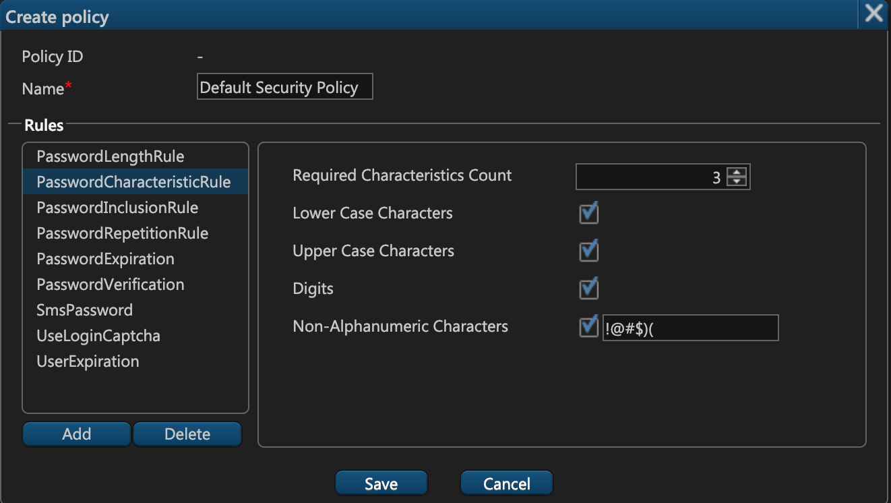
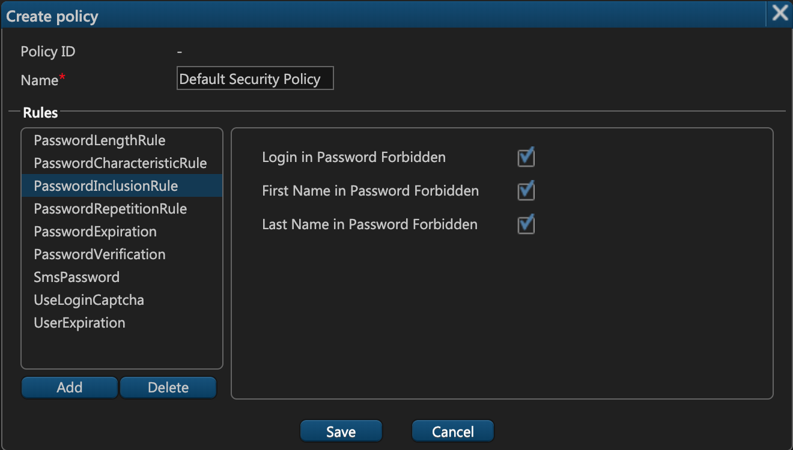
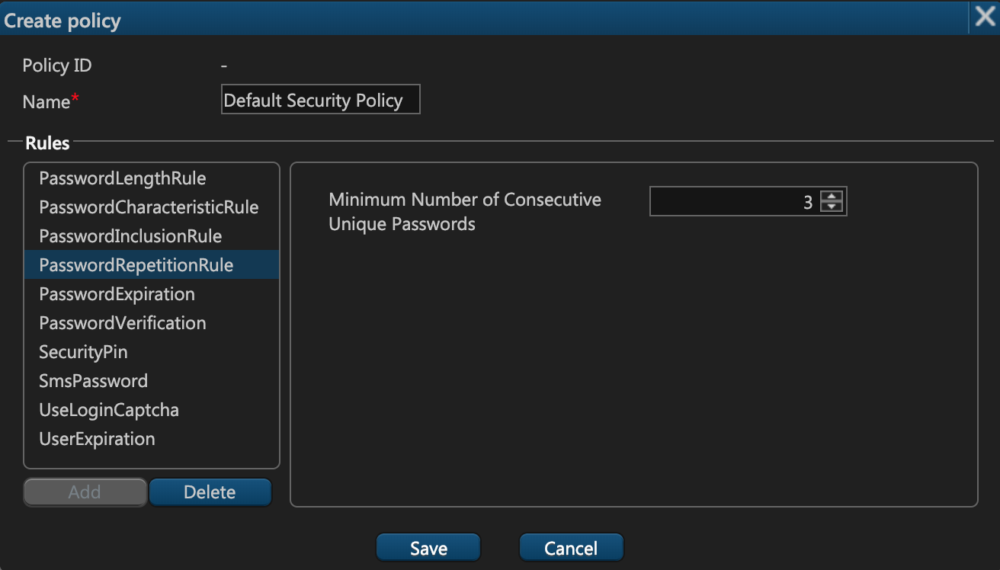
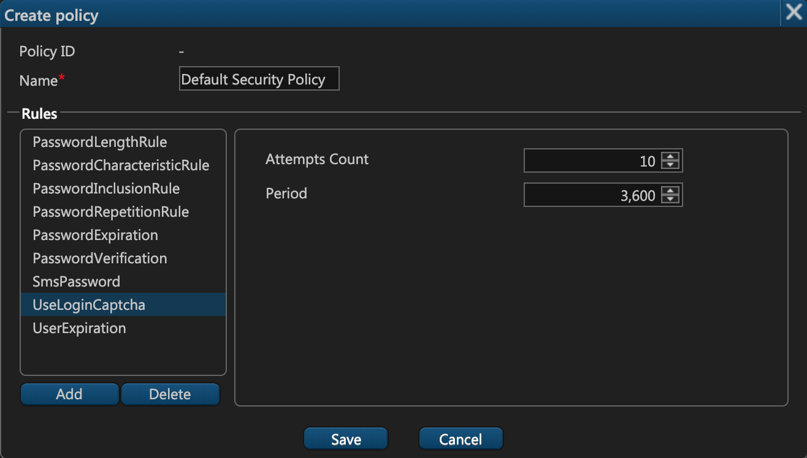

# System Security Policies

### Introduction

In ETNA Trader, each [user group](managing-user-groups.md) must have a **security policy** that defines various security-related settings like minimum password length, two-factor authentication, and so forth. These security policies can be configured in the **System Security Policies** widget \(only available to administrators\).

Whenever you create a new user group, you must specify a security policy for this group, and it will then be applied to all members of this group. Security policies are one of the most critical components of ETNA Trader, so ensure that you configure them in a way that complies with your corporate requirements.

### Creating Security Policies

To create a new security policy, first add the **System Security Policies** widget, under **Add Widget**. 

The **System Security Policies** widget will immediately be added, listing all of the existing security policies.

To add a new security policy, click **Add**. The policy creation window will appear, where you should first to specify the name of the policy. Then proceed to configure this policy's rules \(9 in total\).

### Security Policy Rules

Below the name of the security policy there's a table with all of the rules that this policy defines. To add a new rule, click **Add** below the list. 

Let's examine each rule and its corresponding parameters in detail.

### PasswordLengthRule

This rule defines the **minimum** and **maximum** **length** of the password that the user must use in order to sign up in the web terminal. Both values must be integers.

### PaswordCharacteristicRule

This rule defines extra requirements for user passwords:

* **Required Characteristic Count**. This option indicates how many of the following password requirements should be met. For example, if you enter **3**, the user will have to at least use lower case characters, upper case characters, and digits \(or a different combination of three conditions\).
* **Lower Case Characters**. With this option enabled, users will be obliged to use at least one lower case character in the password.
* **Upper Case Characters**. With this option enabled, users will be obliged to use at least one upper case character in the password.
* **Digits**. With this option enabled, users will be obliged to use at least one digit in the password. 
* **Non-Alphanumeric Characters**. This option will oblige users to use at least one character from the list of characters in the text field \(in our case it's "**!@\#$\)\("**\).

### PasswordInclusionRule

This rule defines the information that users must specify in order to reset their forgotten password:

1. **Login**. With this checkbox selected, users will have to specify their login in order to reset their password.
2. **First Name**. With this checkbox selected, users will have to specify their first name in order to reset their password.
3. **Last Name**. With this checkbox selected, users will have to specify their last name in order to reset their password.

If all checkboxes are selected, users will have to provide all three entries.

### PasswordRepetitionRule

In ETNA Trader, if a user wants to change their password, our system will permit them to enter  a new password that is identical to one of their previous passwords. Some companies frown upon re-using older passwords, and for that reason we've implemented a feature that allows administrators to specify the number of unique consecutive passwords for all users.

For example, if you entered **3**, whenever a user attempts to change their password, they will be unable to specify a new password that matches one of their last **three** passwords.

### PasswordExpiration

This rule enables you to to specify the number of days after which all users' passwords will be expired. For example, if you'd like your users to update their passwords annually, enter **365**, and each year their password will have to be reset.

### PasswordVerification

The first four rules described above — PasswordLengthRule, PasswordCharacteristicRule, PasswordInclusionRule, PasswordRepetitionRule — can be automatically added to a security policy by simply adding another rule — **PasswordVerification**. When you add PasswordVerification, all those four aforementioned rules will be configured with the default settings. This rule is primarily aimed at companies that require some sort of password compliance.

### SMSPassword

This rule has no parameters and it allows you to enable two-factor authentication for all users within the user group with this security policy. If a user has an associated phone number, we'll send an SMS to that phone number, and the user will be required to enter the code from the SMS in addition to their regular password. 

### UseLoginCaptcha

Adding this rule will prompt your users to enter a captcha during authentication to verify that they're not robots. This rule has two configurable parameters:

1. **Attempts Count**. Indicates the number of failed captcha attempts that users can make during the **Period**. 
2. **Period**. Indicates the timeframe \(in seconds\) in which these attempts can be made. For example, if you have 10 attempts during 3600 seconds, your users will be able to fail no more than 10 captcha verifications every hour.

### UserExpiration

This rule defines the number of days after which a user should expire. This option is useful for demo environments where each user should only have access to the web terminal for a specified number of days. After this time period passes, each user's account will automatically be disabled.

### Combining Multiple Security Groups

In ETNA Trader, one user can belong to multiple user groups, and each of these groups has its own security policy. Consequently, you might assume that there must be a conflict between security policies of all the groups a user belongs to. Actually, our system automatically resolves such conflicts by selecting the most stringent permissions.

For example, if a user belongs to two user groups, one of which requires user passwords to have at least 10 characters while the other requires passwords with at least 12 characters, users will be required to use passwords with at least 12 characters. Similarly, if one policy makes user accounts expire in 30 days, and the other in 50 days, ultimately all user accounts will expire in 30 days — according to the more stringent policy.

However, it's critical to understand that savvy administrators could invent mutually exclusive security policies which would render the user account inactive. For example, suppose a user belongs to two groups, one of which requires passwords' length to be in the range from 8 to 12 characters while the other group requires passwords' length to be in the range from 14 to 20 characters. In this scenario the user will be unable to sign up because they will be unable to meet the requirements of both security policies.

Our recommendation here would be to design security policies that complement each other rather than cancel each other out. Before adding a user to multiple groups with different security policies, first determine if these policies are compatible with each other.

 

