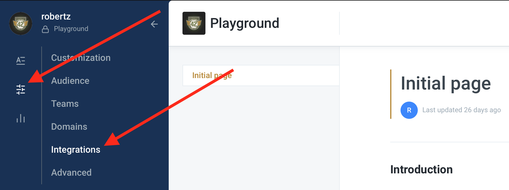
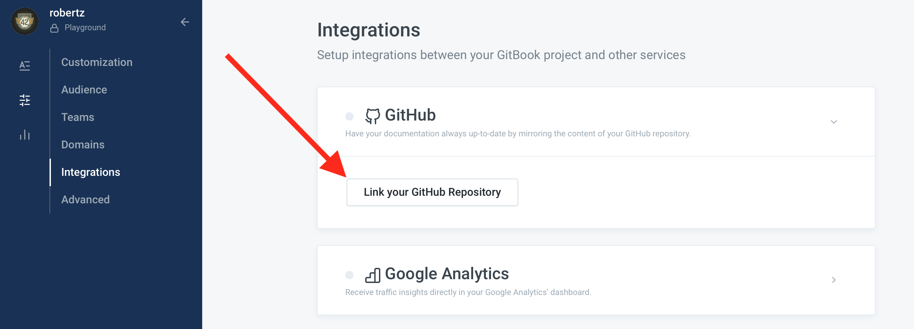

# Custom Documentation

### Introduction

ETNA Trader's user documentation is hosted on a service called GitBook. It's an extremely versatile documentation management system that stores content in the markdown format. GitBook also offers bi-directional GitHub synchronization, meaning any documentation can quickly be uploaded to and from GitHub. We use GitHub to share our user documentation with our clients who would like to build their own custom documentation based on our content.

As a client of ETNA, you have the opportunity to private-label our documentation by hosting it on your own corporate GitBook account.


If you have decided to go with your own custom documentation, please send a request to our [support team](https://www.etnasoft.com/contact-support/) and they'll give you further instructions.


### Private-Labeling User Documentation

There are three steps to private-labelling user documentation of ETNA Trader:

1. Forking our GitHub repository that stores the documentation.
2. Syncing your GitHub repository with your own GitBook account.
3. Customizing the documentation.

### 1. Forking ETNA's GitHub Repository

The first step you need to take in order to private-label our user documentation is to fork our GitHub repository that stores the user documentation \(the link will be provided by our support team\). Once our repository is copied to your designated repository, proceed to sync it with your GitBook account. 


If you don't want to use GitBook, you can simply download the source files \(.md\) and use them to create something of your own. 


### 2. Syncing GitHub with GitBook

Next, go ahead and sign up for [GitBook](https://gitbook.com/) and then create an empty book. This book will be used to store the documentation when you import the content from your repository. Once done, open the book and navigate to **Integrations** in the left side-bar.

On that page, click **GitHub** and then click **Link Repository**.

Proceed to import your content from GitHub, and once you're done, you'll have a fully functioning book with modifiable documentation.

### 3. Customizing the Documentation

Now that you have copied our documentation, go ahead and modify it by replacing our screenshots with the custom ones. Once the documentation is ready to be shipped to your customers, consider configuring a custom url for this documentation on your domain to make it look more professional \(instead of yourcompany.gitbook.io\). 


Whenever we update our version of the documentation, all the changes are automatically uploaded to GitHub. At this point you can fork our repository again and incorporate the new content into your own documentation.


