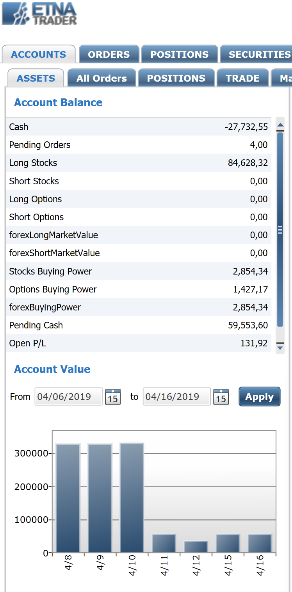
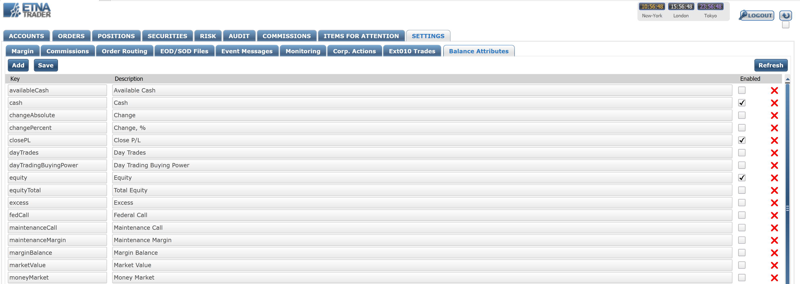

# Release 1.2.47

## Summary

ETNA Trader receives another major update that brings a set of significant features and improvements. In release 1.2.47 we focused on expanding the functionality of our Web API and also made a few under-the-hood tweaks in the back end to improve performance and user experience. We've also addressed a few discovered bugs, improving the overall stability of ETNA Trader.

### Web API Improvements

The biggest improvement of release 1.2.47 is the update of our Web API. First, we've made a few changes to the existing methods for retrieving security information, account information, and placing new orders. Second, we've added a new method for retrieving chart data in the Microsoft Excel format.


If your solution is integrated with our web API, please note that the following endpoints are no longer supported:

* Get Securities By Mask \([GET](https://pub-api-et-demo-prod.etnasoft.us/api/reference/index#!/Securities/Securities_GetSecurities) [/v{version}/securities](https://pub-api-et-demo-prod.etnasoft.us/api/reference/index#!/Securities/Securities_GetSecurities)\):
  * Replaced by [Get Equity Info By Mask](../../rest-api/broker-api/securities/get-securitys-info-by-mask/) and [Get Option Info By Ticker](../../rest-api/broker-api/securities/get-options-info-by-ticker/).
* Get Securities by ID \([GET](https://pub-api-et-demo-prod.etnasoft.us/api/reference/index#!/Securities/Securities_GetSecurityById) [/v{version}/securities/{securityId}](https://pub-api-et-demo-prod.etnasoft.us/api/reference/index#!/Securities/Securities_GetSecurityById)\).
  * Replaced by [Get Equity's Info by ID](../../rest-api/broker-api/securities/get-securitys-info-by-internal-id/) and [Get Option Info by ID](../../rest-api/broker-api/securities/get-options-info-by-id/).

And the following endpoints have been modified:

* Place Order \([POST](https://priv-api-et-demo-prod.etnasoft.us/api/reference/index#!/Orders/Orders_PlaceOrder) [/v{version}/accounts/{accountId}/orders](https://priv-api-et-demo-prod.etnasoft.us/api/reference/index#!/Orders/Orders_PlaceOrder)\);
  1. The **SecurityID** parameter has been replaced with **Symbol** \(ticker\);
  2. The **dryRun** parameter is no longer available — there's a [separate endpoint](../../rest-api/broker-api/orders/validate-order-placement/) for order placement validation.
* Replace Order \([PUT](https://priv-api-etnatrader-dev.etnasoft.us/api/reference/index#!/Orders/Orders_ReplaceOrder) [/v{version}/accounts/{accountId}/orders/{orderId}](https://priv-api-etnatrader-dev.etnasoft.us/api/reference/index#!/Orders/Orders_ReplaceOrder)\).
  1. The **SecurityID** parameter has been replaced with **Symbol** \(ticker\);
  2. The **dryRun** parameter is no longer available — there's a [separate endpoint](../../rest-api/broker-api/orders/validate-order-replacement/) for order    replacement validation.


#### Retrieving Users' Positions

Starting from version 1.2.47, users' current positions in a particular security can only be retrieved by **providing the ticker symbol** of this security \(as opposed to providing the internal ID of the security in previous releases\).



#### Retrieving Security Information

Starting from version 1.2.47,  retrieving information about securities has been split into two sets of methods — one for equities and the other for options:

















We've also added two new methods for listing all existing equities and options:





#### Placing New Orders

The last change we made to our Web API is the revamped order placement mechanism. Previously, if you wanted to ensure that a new order is properly constructed, you could simply add the **dryRun** parameter in the request header. Starting from version 1.2.47, the **dryRun** parameter is eliminated from the order placement and replacement requests and instead we're introducing separate order placement and replacement endpoints:





Once you've ensured that an order is properly constructed, you may proceed to place it \(or replace it\) with the regular order placement and replacement API requests. Also note that in release 1.2.47 we've changed the list of required parameters that must be provided in a new order — instead of providing a security's internal ID in ETNA Trader you should simply provide its ticker symbol.





#### Exporting Chart Data in the Microsoft Excel Format

The last addition to our Web API is the ability to export chart data in the Microsoft Excel Format:



### Balance Attributes

Another notable improvement of release 1.2.47 is the ability to manage trading accounts' balance attributes. These attributes are displayed in ETNA Trader's **Back Office**, and from now on you can determine which of these attributes should be visible to the users.

These attributes can be managed on the **Balance Attributes**, under **Settings**. There you can enable or disable these attributes as well as modify their descriptions.

### Changes to the Mark Price Formula

In release 1.2.47 we've also changed the way the mark price is calculated for stocks. From now on, the mark price for every stock during the regular trading hours is equal to:

* the **last** price if Bid &lt; LastPrice &lt; Ask;
* the current **ask** price if Last &gt;= Ask ;
* the current **bid** price if Last =&lt; Bid.

During the pre-market, post-market, and non-trading hours, the mark price is equal to the last closing price. 

### Support for Thomson Reuters Beta Fix Protocol

The last highlight of release 1.2.47 is the support for the FIX protocol provided by Thomson Reuters BETA.

