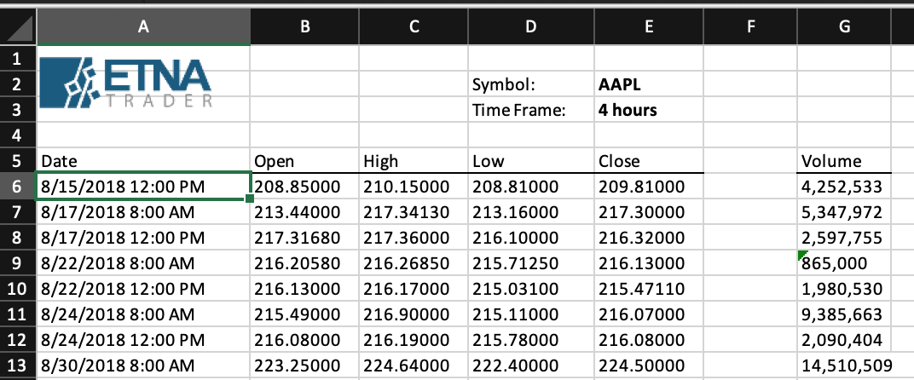

# Get Chart Data in the Excel Format

### Overview

This POST endpoint enables you to retrieve chart data for a particular security in the Microsoft Excel \(.xlsx\) format.

There are four required parameters that must be provided in the request:

1. **Et-App-Key** \(header\). This is the unique key of your app that identifies your app when communicating with our service. It can be found it in the **BO Companies** widget. When editing the company's settings, navigate to the **WebApi** tab and look for the required key \(it could be a key for the web terminal, the mobile app, or a custom key\).
2. **Authorization** \(header\). This is the authorization token from the very first [token request](../../authentication/).
3. **API version** \(path\). Unless necessary, leave it at "1.0".
4. **settings** \(body\). This is a JSON dictionary that contains information about the enquired security.

#### Enquired Security Syntax

Here's an example of the request body with the information about the enquired security.

```javascript
{
    "Securities":[4],
    "Indicators":[
        {"name":"Volume",
         "args":[],
         "type":"Volume",
         "text":"Vol"}],
     "TimeFrame":{
         "startDate":1520226000,
         "endDate":1551797512,
         "candlesCount":-1,
         "period":"4h",
         "includeNonMarketData":false},
     "DefaultFileName":"AAPL_4%20hours_From_03.05.2018_To_03.05.2019.xlsx"
 }
```

where:

| Parameter | Description |
| :--- | :--- |
| Securities | This is an array that contains securities which chart data needs to be retrieved. |
| Indicators | This is an array with the required indicators. |
| TimeFrame | This is the timeframe for which the chart data needs to be retrieved. |
| DefaultFileName | This is the filename of the Excel file that will be returned. |
| StartDate | This is the beginning of the period for which the data will be retrieved. |
| EndDate | This is the end of the period for which the data will be retrieved. |
| CandlesCount | This is the number of candles that will be retrieved for the specified time period. |
| Interval | This is the trading data interval for the specified time period.  |


All parameters must be provided in the body JSON; otherwise the chart data will not be retrieved.


Here's the final template for this API request:

```text
POST apiURL/v1.0/history/export
```

### Response

In response to this API request, you should expect a .xlsx file that contains chart data for the enquired security. Following is a sample of such file:





### Common Mistakes

Here are some of the common mistakes that developers make when attempting to retrieve chart data for a security in the Excel format.

#### Failing to Specify the Et-App-Key Parameter

If you specify the wrong Et-App-Key parameter or fail to include it in the header altogether, you'll get the following error:

```javascript
{
    "error": "Application key is not defined or does not exist"
}
```

#### Incorrectly Specifying the Request Body 

Another common mistake when attempting to retrieve the chart data for a security is incorrectly structuring the request body. It's critical that you follow the template provided above and specify all of the required parameters. Otherwise you'll receive the 500 status code and the following error message: 

```javascript
{
    "message": "An error occurred while processing your request",
    "error": "Unexpected server error"
}
```

The following article covers the syntax for this API request in detail.

