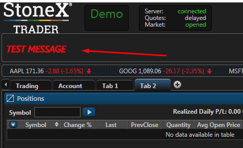

# List User's Accounts

### Overview

This endpoint enables you to list all trading accounts associated with the user whose authorization token was provided in the request header. Note that trading accounts are distinct from the regular user accounts.


In order to request trading accounts of a particular user, you must use an [authorization token](../../../public-api/authentication/requesting-tokens/) of an administrator. Using authorization tokens of regular users will lead to the 401 status code.


There are four required parameters that must be provided in the request:

1. **Et-App-Key** \(header\). 
   1. This is the unique key of your app that identifies your app when communicating with our service.  It can be found it in the **BO Companies** widget. When editing the company's settings, navigate to the **WebApi** tab and look for the required key \(it could be a key for the web terminal, the mobile app, or a custom key\). 

      
2. **Authorization** \(header\). This is the authorization token from the very first [token request](../../../public-api/authentication/requesting-tokens/).
3. **Internal user ID** \(path\). This is the numeric ID of the user  whose trading accounts you'd like to list. 
4. **API version** \(path\). Unless necessary, leave it at "1.0"

The user information request must be sent to the following URL:

```text
apiURL/v1.0/users/644(userID)/accounts
```


To list the trading accounts of the user whose authorization token you provide in the request header, replace the internal user ID with **@me**


### Response

As a response, you'll receive a JSON file with the trading accounts of this user:

```javascript
[
    {
        "Id": 644, //this is the user ID from the header
        "ClearingAccount": "6303", 
        "AccessType": "Full", 
        "MarginType": "DayTrader", 
        "Enabled": true
    }
]
```

where:

| Parameter | Description |
| :--- | :--- |
| Id | This is the user ID that you provided in the header |
| ClearingAccount | This is the internal number of the trading account  |
| AccessType | This is the access type of the account. Read more about it [here](../../../../administrator-guide/administrators-widgets/managing-users/#trading-accounts). |
| MarginType | This is the account type. Read more about it [here](../../../../administrator-guide/administrators-widgets/managing-users/#trading-accounts). |

### Common Mistakes

Here are some of the common mistakes that developers make when requesting the list of trading accounts of a particular user:

#### Requesting as a Non-Administrator

One of the most common mistakes that developers make when making this API request is to use the authorization token of a non-administrator. It's critical to understand that in order to be eligible for listing trading accounts of a particular user, the requester must be an administrator. Otherwise you'll receive the 401 status code with the following message:

```javascript
{
    "Message": "Authorization has been denied for this request."
}
```

So be sure to use the authorization token generated with an administrator's credentials.

#### Failing to Specify the Et-App-Key Parameter

If you specify the wrong Et-App-Key parameter or fail to include it in the header altogether, you'll get the following error:

```javascript
{
    "error": "Application key is not defined or does not exist"
}
```

#### Specifying the Regular User ID Instead of the Internal One

Another common mistake when making this request is specifying the regular user ID instead of the internal ETNA Trader ID. Doing so will result in the 400 status code and the following error message:

```javascript
{
    "Message": "The request is invalid."
}
```

