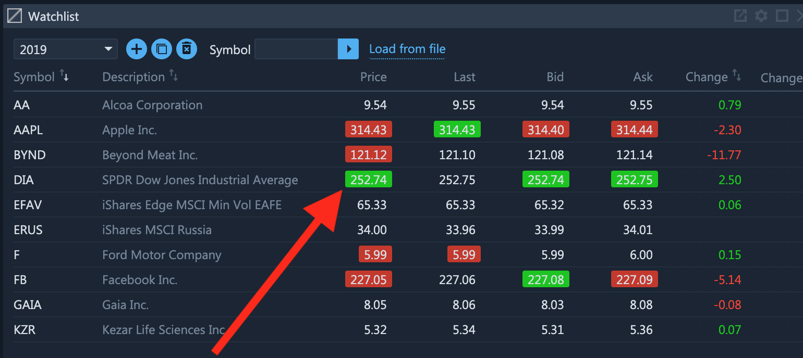
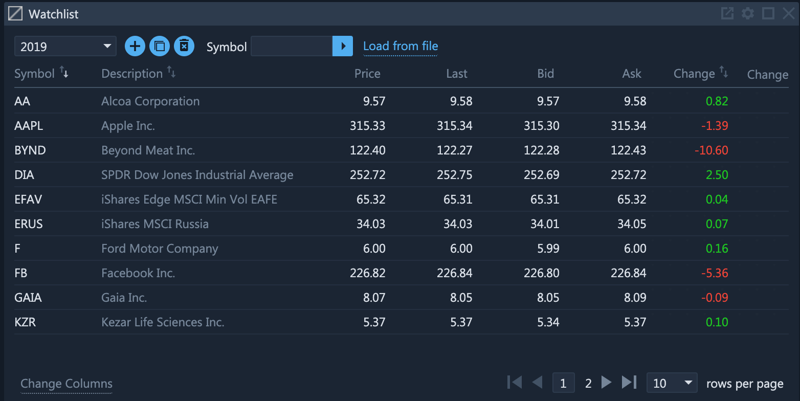

# Tips for Enhancing Performance

### Introduction

ETNA Trader is a highly complex trading suite that was designed for professional traders. For this reason the layout of the platform incorporates numerous widgets that are continuously updating information like the current quotes, account balances, news, current positions, chart candles, and so forth. With every incoming piece of data, the user interface must also be adjusted to reflect all of the latest changes. On top of that, ETNA Trader features some trading-specific UI conveniences like quote flashing and data streaming — all of which can collectively put much strain on the CPU and impede the overall performance of the platform. And in this article we will provide a few tips on how to optimize performance by fine-tuning certain settings.

Hello Christopher,I have discussed your case with the team. Here it is a list of recommendations that should help you with web performance.1\) In User Settings -&gt; Layout Settings setup Quotes Flashing as Without Flashing. 2\) You could re-setup your layout using one widget for one tab. As we did on a call for the Option ticket widget. It must help to load the page faster when you sign in to the platform for the first time and on a tab switching. It is actual for tabs that loading slowly and has few widgets. 3\) Check settings in Chrome and try to find harmful software that can reduce Chrome performance. \(link: [chrome://settings/cleanup](chrome://settings/cleanup)\)4\) Could you check your CPU loading with the next cases?  
- after computer start   
- close all programs including System Tray in Taskbar. They could be started automatically. Open [alphaplan.us](https://slack-redir.net/link?url=http%3A%2F%2Falphaplan.us) in one Google Chrome tab.- If it is possible to check the performance using another browser. Please use Firefox and open [alphaplan.us](https://slack-redir.net/link?url=http%3A%2F%2Falphaplan.us) in one tab.Had you a chance to check  [alphaplan.us](https://slack-redir.net/link?url=http%3A%2F%2Falphaplan.us) performance on another machine?I appreciate screenshots in reply, this way I can understand results quickly.

### Tip 1: Disable Quote Flashing

One of the most CPU-intensive UI elements are flashing quotes, especially if there are several widgets displaying dozens of securities with their corresponding quotes.

To disable flashing quotes, navigate to your personal settings and, under **Layout Settings**, expand the **Quotes Flashing** drop-down menu, and select **Without Flashing**. Click **OK**.

After the new settings have been applied, the quotes will no longer change their background color upon updating. But most importantly the CPU usage will dramatically decrease, hopefully improving the overall performance.

### Tip 2: Reduce the Number Of Widgets

Another way of improving performance of ETNA Trader is to reduce the number of widgets displayed on each tab. Naturally each addition widgets consumes additional system resources, which might explain why the platform is underperforming. Try limiting the selection of displayed widgets to one or two per tab and your issues could consequently be resolved.

### Tip 3: Try Using a Different Browser

Some web browsers like Google Chrome are notorious for consuming vast amounts of RAM and CPU resources, slowing down all processes on your computer. This performance dip can also extend to ETNA Trader, forcing certain components of the platform to underperform. For this reason we suggest you opt for an alternative web browser like Firefox or Opera and see if they display better performance while using ETNA Trader.

