# Chart

### Exploring the Chart Widget

In order to view the market from nearly every conceivable angle, ETNA Trader offers different chart types that stream up-to-date data. From candlesticks to bar, every chart type updates data automatically as it unfolds.

You can also choose to show a chart in four different modes:

* Line;
* Bar;
* Candle Sticks;
* OHLC (Open-High-Low-Close).

The drawing tools menu allows the user to select from a number of different drawing tools. Drawing tools overlap the price data and can be used to mark-up the charting area. Drawing tools include Fibonacci, trend lines, support or resistance (price range) and text notes.

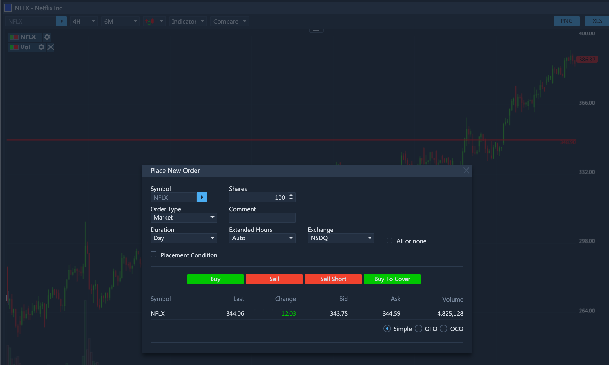

### Chart Time Frames and Periods

Time frames and periods are crucial to proper examination of price charts. In the **Chart** widget, users have the ability to select a specific time frame and then view it over a specified time period. For this purpose the platform contains two drop-down menus:&#x20;

1. **Time frame**. This drop-down menu enables you to specify the required time frame. For example, if you select `4 hours`, the Chart widget will display a chart drawn using quotes registered every four hours. Similarly, if you select `1 year`, the chart will be drawn using quotes registered annually (eg. 2000-2020).

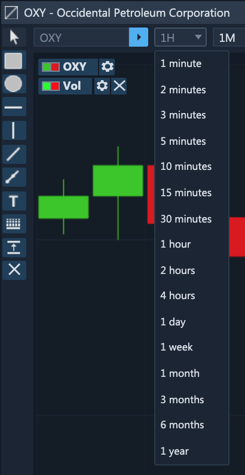

&#x20; 2\. **Time period**. This drop-down menu enables you to specify the period over which the chart will be drawn. For example, if you set the time frame to `4 hours` and the time period to `6 months`, the Chart widget will display a chart drawn with quotes registered every four hours over the last six months. It's also possible to select a precise number of chart candles to be displayed (500 bars, 2000 bars, etc.)

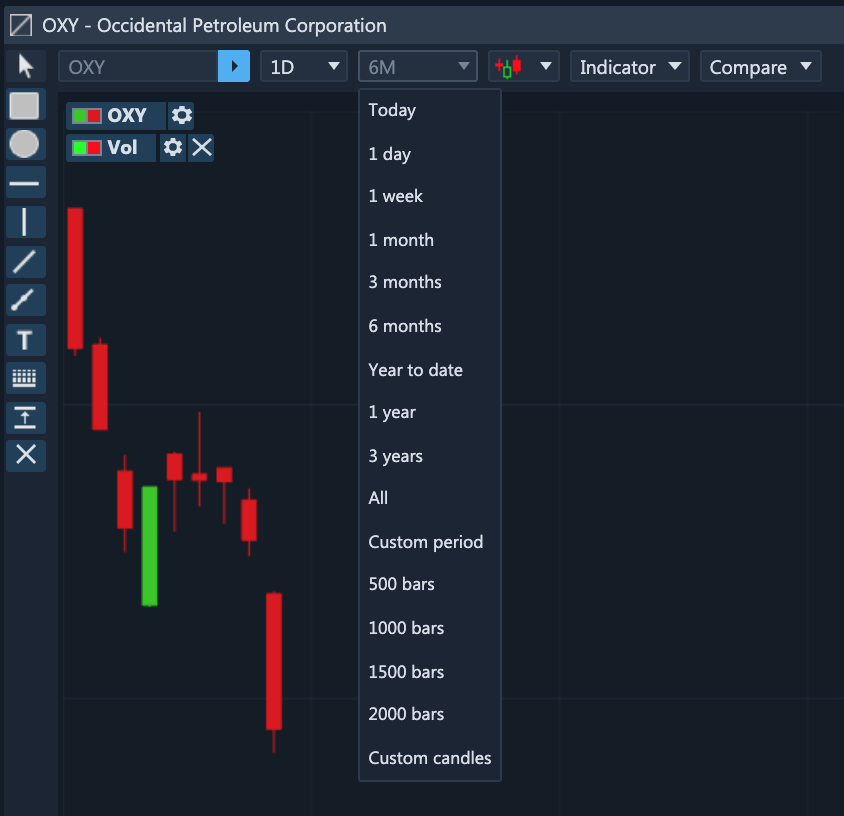

### Technical Analysis

Users have the option to hide and unhide both the chart and the shape panels that provide tools for comprehensive technical analysis.

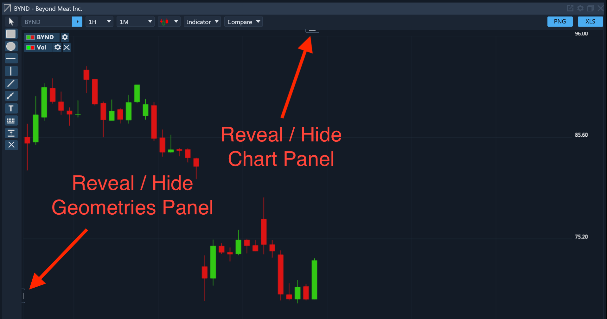


Once you select a geometric tool, you automatically enter into the editing mode; to exit it, click on the cursor icon in the top-left corner.


#### Rectangle

The first geometric tool is called **Rectangle** and, as the name implies, its purpose is to draw rectangular shapes on the chart. You can click-and-drag the mouse over the chart and simultaneously a rectangle shape will be drawn. An unlimited number of rectangle shapes can be drawn on the same chart.

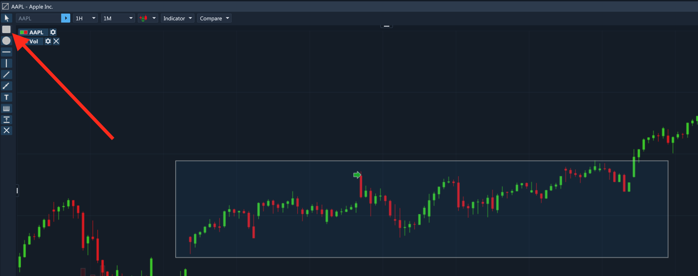

#### Ellipse

The second geometric tool available in the **Chart** widget is called **Ellipse** and its purpose is to draw elliptical shapes on the chart. The shape of the ellipse is stretched vertically or horizontally depending on the movement of the mouse during drawing.&#x20;

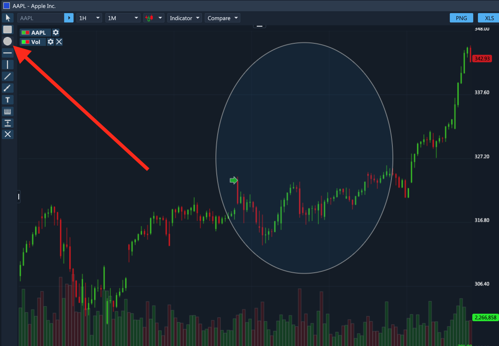

#### Horizontal Line

The **Horizontal Line** is one of the most commonly used tools in technical analysis and it essentially enables you to draw key resistance levels on the chart. Simply click anywhere on the Y axis of the chart and a horizontal line will immediately be drawn.

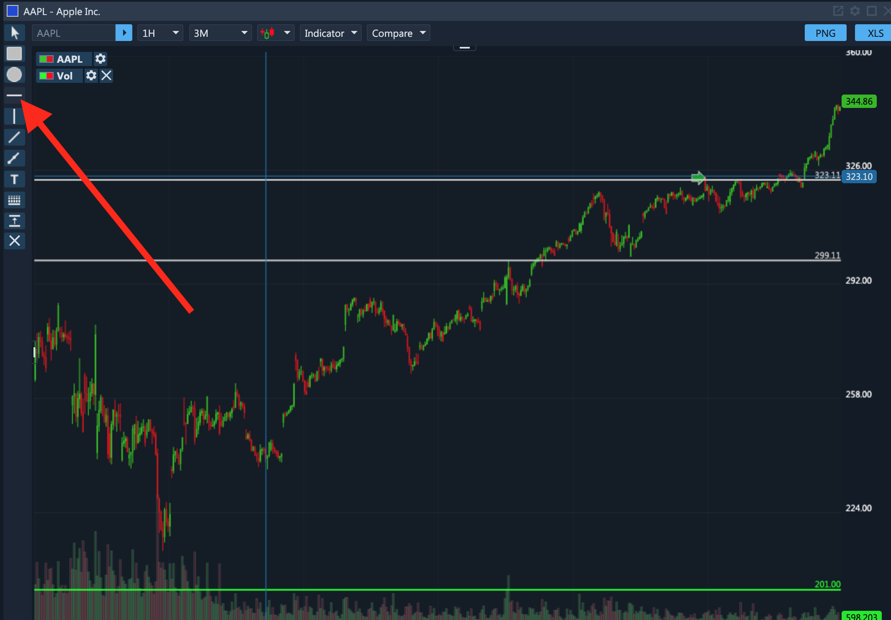

#### Vertical Line

Similar to the horizontal line, a vertical line enables you to draw vertical lines to delineate the most critical parts of the chart.

.png>)

#### Trend Line

Trend line is another commonly used tool in technical analysis and its purpose is to identify channels in which the price of the security is moving. To draw a trend line, find a starting point, and then click-and-drag the mouse to the end point.

#### Ray

Ray is similar to trend line in that it enables you to draw any line on the chart; however, it only requires you to specify the starting point. Once you click anywhere on the chart — that becomes the starting point and as you hover the mouse in any direction — a "ray" will be drawn all the way to the chart's border.

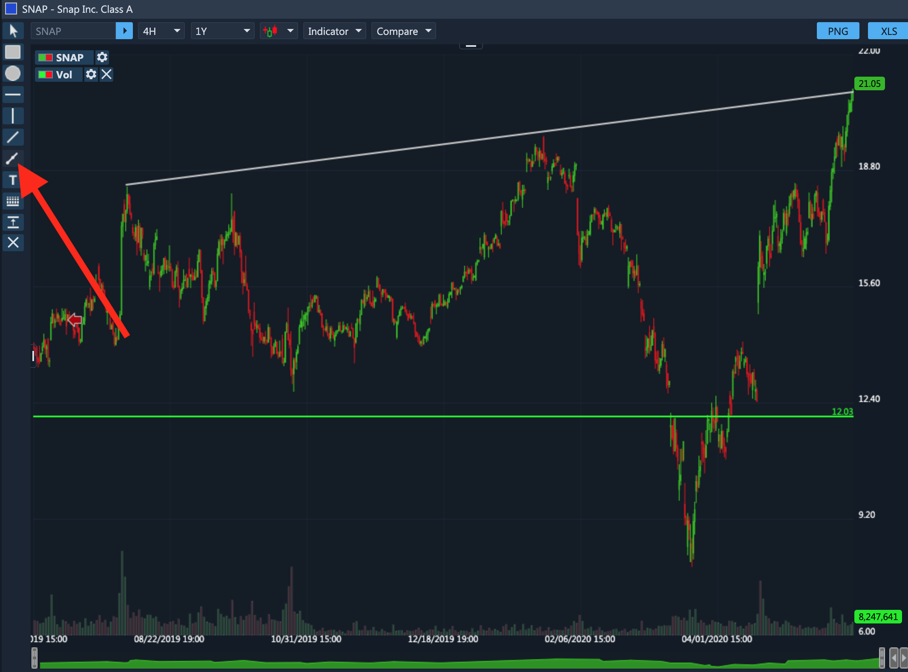

#### Text

**Text** enables you to add a small text box anywhere on the chart. Simply click anywhere on the chart to create a new text box. To change the text, right-click on the text box and click **Settings**. In the pop-up window you can specify the text, change the font, the font size, and the font color.

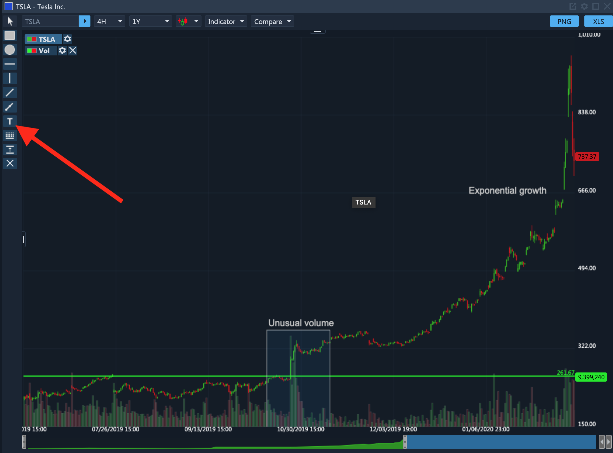

#### Price Range

**Price Range** enables you to draw a nice-looking gap between to price points with a dollar and a percentage increase/decrease in the middle. Simply click on the starting point and then drag the mouse to the end point, and the price range will be created.

#### Clear All

Finally, there's a clear all button that allows you to remove all shapes, lines, texts, and price ranges from the chart.

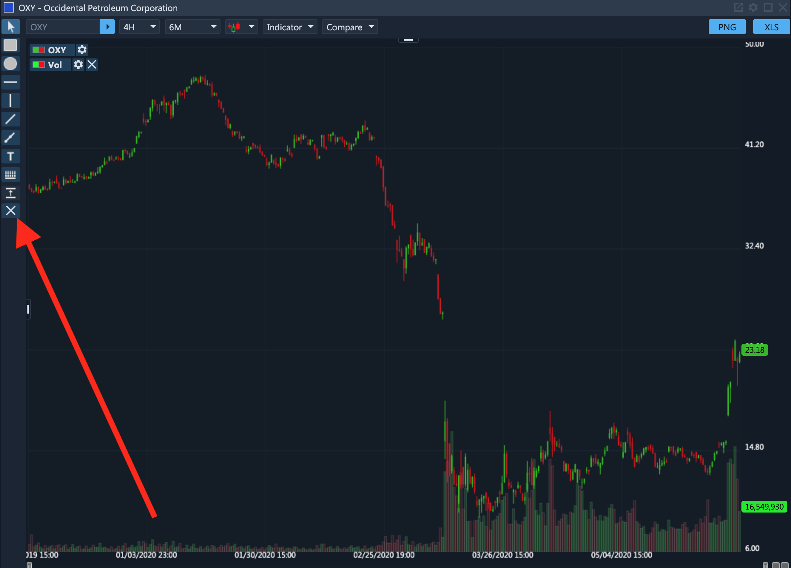

### Indicator Preferences

Every technical indicator has a set of preferences associated with it. Almost all indicators have common preferences like period (number of bars for which the indicator is calculated) while select indicators also have their own unique preferences (e.g. VWAP). The preferences of every indicator displayed on the Chart can be configured by clicking on the little gear icon as depicted in the following screenshot:

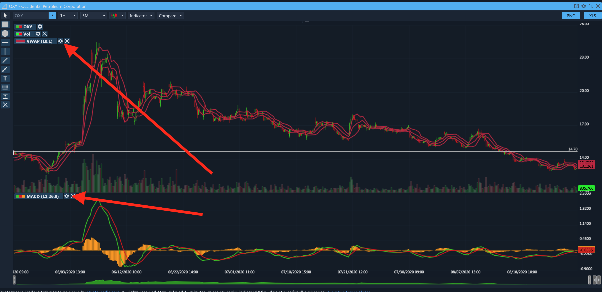

In the appeared pop-up window there will be a selection of parameters available for this particular indicator:

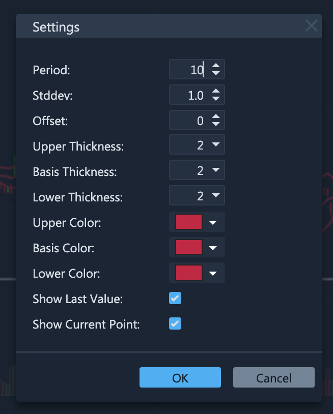

Once you have fine-tuned all of the settings, click **OK**, and they will immediately be applied.

#### Period

Period is a parameter available for almost all technical indicators. It essentially signifies the number of candles using which the indicator is calculated. For instance, if you set this parameter to `10`, each data point that comprises the indicator's chart will be calculated using the previous `10` candles of the price chart. For example, suppose you have a two-hour chart for a specific trading session where you have `7` candles in total. Calculating an indicator with a period of `10` will involve calculating `7` data points for the indicator chart (one for each corresponding data point of the price chart). And each of those `7` data points of the indicator chart will be calculated using the `10` previous candles of the corresponding data point of the price chart. In other words, for every data point of the price chart i\[10], the corresponding data point of the indicator chart will be calculated using the i\[0]...i\[9] candles. If the last `10` candles  are unavailable, ETNA Trader will utilize candles from the previous trading session. For example, for the first candle of the day, the indicator will be calculated using the last `10` candles of the previous trading session.&#x20;


This logic may somewhat vary depending on the indicator in question.


### Chart Customization

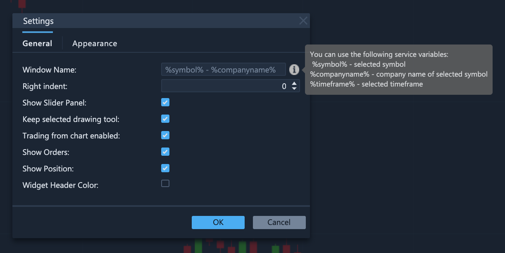

The charting menu bar shows different options that can be expanded and used to select the time frame, chart type, technical indicators, apply comparisons to other securities, and draw different trend lines and shapes. The chart also provides access to many other features and settings, including being able to trade from the charts, change the style/ appearance of chart and the time frame as well as add technical analysis tools.

### Trade Shortcut in Charts

In ETNA Trader, the Chart widgets provides a quick shortcut to place a new order. When viewing a chart for the desired security, simply double-click on a particular candle and the order placement window will pop up.

On this widget you can specify the required type of the order, the limit price, and then click Buy/Sell/Sell Short/Buy To Cover.
