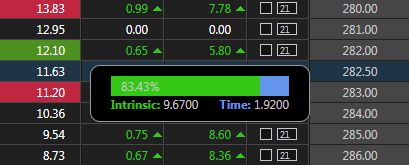

# Options

### Exploring the Option Chain Widget

### Greeks

Various sophisticated hedging strategies are used to neutralize or decrease the effects of risk when taking a position in an option.

### Calls and Puts

There are two types of options: calls and puts. Furthermore, there are four types of participants in options markets depending on the position they take: 

1. Buyers of calls;
2. Sellers of calls; 
3. Buyers of puts; 
4. Sellers of puts.

### Strike Price and Intrinsic value

One of the columns of the _Option Chain_ widget is entitled **Mark** and it contains the current mark price of the underlying security. Please note that this column is available only for Call and Put options.

 As you hover over the column with the mark price, the following pop-up will be prompted:

The pop-up contains two parameters: 

1. **Intrinsic**

\*\*\*\*$$Intrinsic = StockMark - Strike$$ ****

The `Intrinsic` parameter is calculated as the difference between the underlying security's mark price and the option's strike price.

   ****2. **Time**

\*\*\*\*$$Time = Option Mark - Intrinsic$$ ****

The `Time` parameter is calculated as the difference between the option's mark price and the **Intrinsic** parameter.

