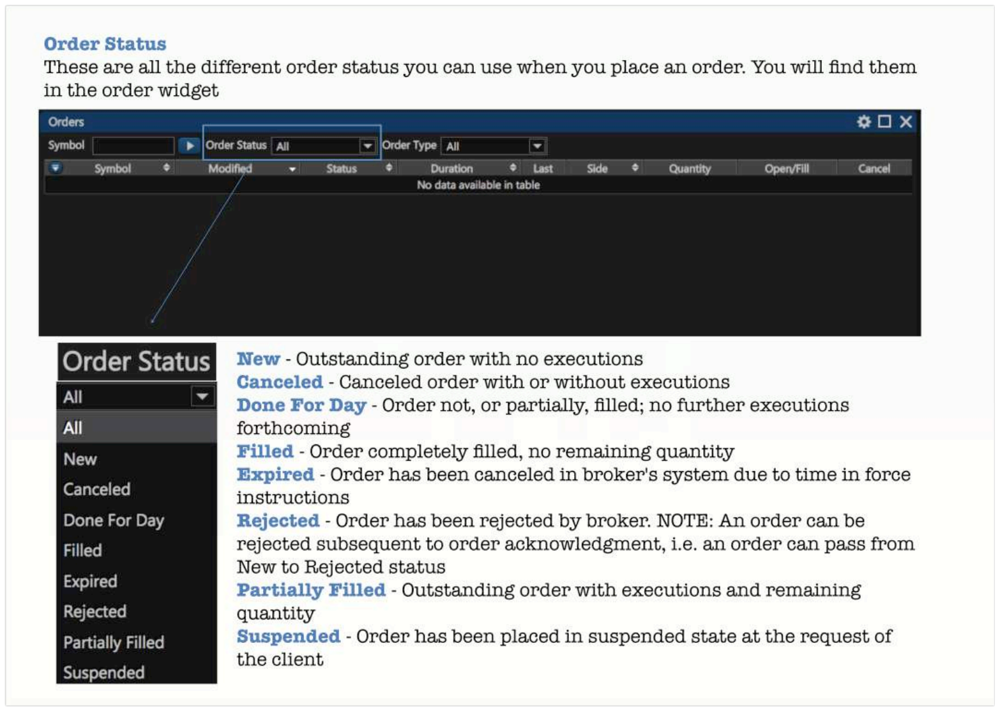
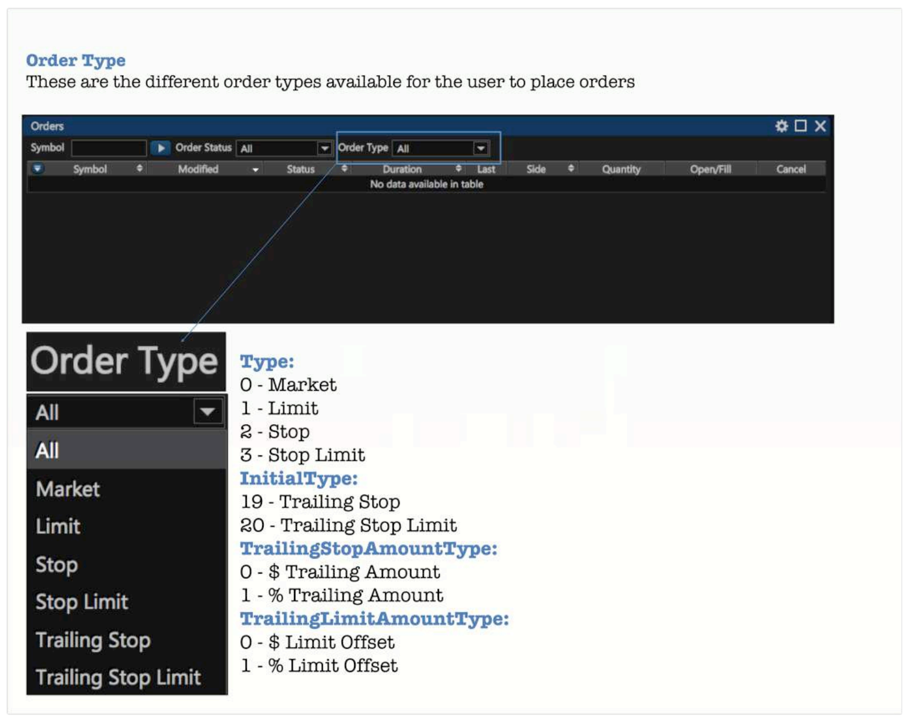
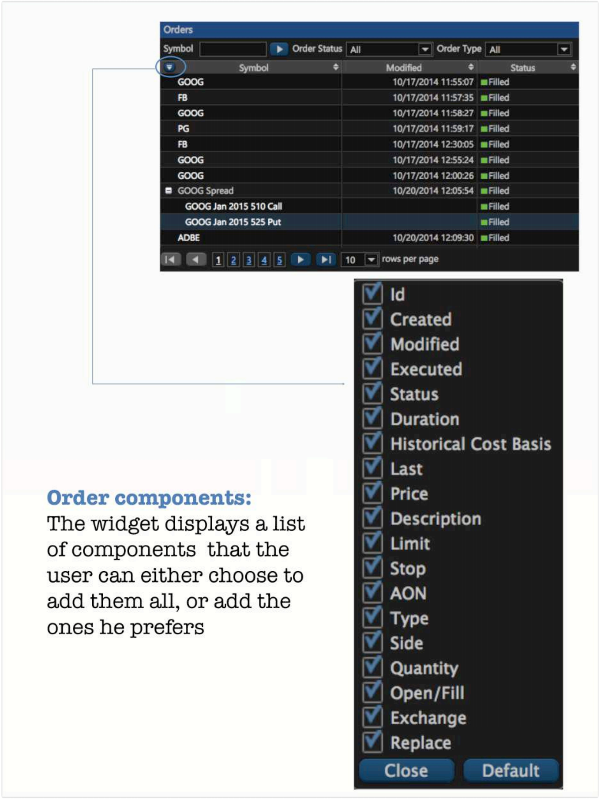

# Orders

### Exploring the Orders Widget

Before you start conquering the world of trading, ETNA Trader gives you the chance to users to trade with virtual money for product evaluation, trading educational or to test their trading strategy to experience the full range of ETNA Trader's trading capabilities in a real-time market environment, without risking any of your own money. All customers will start with USD 1,000,000 of paper trading. You can use all ETNA Trader's order types, trade all securities available in your demo account. Every trade entered into your ETNA Trader's paper trading account will not actually execute on any exchange or settle at a clearing house. However, the price of your executions will be determined by real market prices and sizes.

### Placing a New Order

There are two ways to create an order on ETNA Trader's platform:

1. **Option 1**. Type in the symbol in the box in the upper left side of the order widget.
2. **Option 2**. Click on the symbol from your watchlist.

### Order Statuses

### Order Types

Users can set the type of order they want to place from Trade Ticket, Option Ticket widgets, or popups trade ticket when they click on the symbol from the watchlist or a chart.

### Order Placement

### Order Duration

**Duration** means how long an order will remain in the market until it is canceled. Users can set their preferred duration from Trade Ticket, Option Ticket widgets or popups trade ticket when they click on the symbol from the watchlist or a chart. 

1. Day - A day order automatically expires at the end of the regular trading session if it has not been executed. 
2. GTC - Good-till-Canceled - An order that lasts until it's completed or canceled.

### Orders Widget Features

1. **Column Manager.** Users can add or remove columns they need. 
2. **Order filter.** Users are able to sort your orders list by: symbol, order status, order type.
3. **Last added order** will be shown even if you set a filter that isn't suitable for a new added order.

